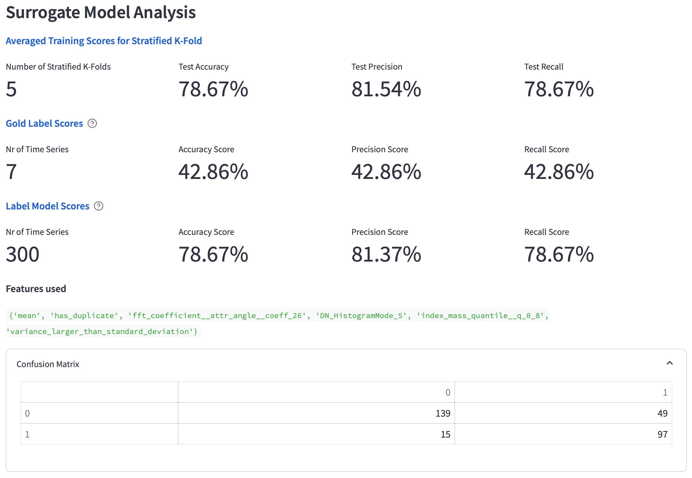

# Welcome to the Label Maker Demo
Interactive Label Generation for Time Series Data

## About

This project is used to evaluate the label maker demo. After successfully installing and using the project
please send the resulting database to johannes.windischbauer@tuwien.ac.at and complete the [survey](#survey).

## Installation

### Prerequisites

Docker needs to be installed and running on the machine.

### Docker

The easiest way to get the application up and running is to start Docker and in the project root run:

```shell
docker compose up --build
```

The application should become available shortly after at `localhost:8501`

#### Build Time Information

| Duration    | Machine                    | Processor    | Memory   | OS                  | incl. download |
|-------------|----------------------------|--------------|----------|---------------------|----------------|
| ~13 minutes | MacBook Pro, 13-Inch, 2018 | 2,3 GHz i5   | 16GB RAM | macOS Sonoma 14.1.1 | yes            |
| 5.4 seconds | MacBook Pro, 16-Inch, 2021 | Apple M1 Max | 64GB RAM | macOS Sonoma 14.0   | no             |

### Build From Source on MacOS (M1)

The frontend is using Python 3.11.6 while the backend utilizes 3.9.6. The setup needs to be completed
for both the frontend and the backend. To build from source a poetry installation is also needed.

Set poetry version to

```sh
poetry env use <python.version | path_to_version>
```

Spawn poetry shell

```sh
poetry shell
```

Install dependencies

```sh
poetry install
```

Install poetry dot-env-plugin to be able to use .env files.

```shell
poetry self add poetry-dotenv-plugin
```

## Run

The preferred way to run the application is by running
`docker compose up`.

If, however, you want to run individual parts of the application on your machine without virtualization you have to
install the poetry dependencies in both subprojects. From there on out you can run start the frontend with:

```sh
poetry run streamlit run Home.py
```

and the backend with:

```shell
poetry run python rpc-backend.py
```

It is also possible to run the frontend or backend in a docker and the other part locally. Depending on your machine,
it can make sense to run the rpc-backend locally for more labeling performance.

## Getting Started

0. Login with the following credentials.  
```pycon
username: user  
password: default
```

To get the most out of your time using the label maker the proposed usage is as follows. 

1. First, take a look at the Sample Labeling Task.

2. Inspect the preexisting labeling results on the Labeling Results page and have a look at the time series
in the table.

3. Afterwards go to the Labeling page. Familiarize yourself with the Labeling Properties and metrics. [(A description of 
the properties and metrics can be found further down on this page.)](#labeling-metrics-and-properties)

4. If you have gained a general understand, move to the Ruleset Creator and create a new rule for an existing ruleset. Once
you are done with the rule creation, go back to the Labeling page and see if what has changed.

Repeat Steps 3 and 4 as often as necessary and save your progress in between.

5. Save your progress by clicking Persist Labeling Result.


Finally, when you are comfortable, switch to the Use Case task and create at least one ruleset to label the data.

Note: You can at any point in time set the Gold Label for a time series to improve the significance of the metrics provided
to you.

## Pages

The current state of the demo tries to show off the functionality and should allow for an evaluation of the use case.
When running the application via Docker, it is currently not possible to add labeling tasks with other feature matrices
and time series for custom evaluation. You can however do this if you run the application locally.
To find out how to structure time series and feature matrices look at `./label-generation-data/resources/`.

### Labeling Page

The labeling page has two tabs. The first tab will show you the selected labeling task.
On this page you can gain a quick overview over the labeling task. You can see how many
time series and features are available for labeling, how many gold labels are available, as well as
how many labeling results already exist.
Furthermore, you can see which labels are available for the task at hand.
From there on, you can create a ruleset or if there are already labeling results go to view them.

**NOTE**: There is a known issue where you have to change the ruleset initially to be able to see the stats. This issue
is caused by a dependency that allows to add labels conveniently to a new labeling task. After switching labeling tasks
once the issue should not arise again.


The second tab offers some additional expanders where you can create new Labeling Tasks, should you run the
application locally.


The data url is the path where the feature matrix is located. Either from the project root should you decide
to move the data into the project or as a global path.
The path where time series are located should point to a directory containing the time series you provide in the feature
matrix.
Labeling tasks cannot be edited or removed.

### Ruleset Page

On this page you can view your ruleset. You can open the expanders of the different rules to view them and their
respective labels. There are three types of rule creators, each offering a varying experience for creating
rules. Each one offers the possibility to give a rule a name so referring to the rule can be easier.
Rules are editable and removable. The rules inside a ruleset are changeable, however, it is not possible to delete a
ruleset entirely.


### Rule Creators

Every rule creator has different strengths and might be used for a different purpose. All rule creators offer the
possibility to show a downscaled sample of how many time series you chose. On the top of the page there is a rule
creator expander and drop down, where you can select which creator should be selected. The selection is cached.

#### Simple Rule Creator

The simple rule creator offers the possibility to explore the data. Features can be selected and the value slider
automatically adapts to the data. When changing feature it sits right at the median. There is also the show statistics
expander that offers min, max, median, first and third quantile information.


#### Advanced Rule Creator

The advanced rule creator enables users to use logical connectives for their rules as can be seen in the screenshot.
Since the creator is free text based there are two drop downs on the bottom of the page showing which features are
available.


#### Free Form Rule Creator

This is the most advanced rule creator and basically allows a user to write full labeling functions.
The features and available labels are available at the bottom of the page. Labels can either be returned by their name
or by their index. Note that ABSTAIN has the index -1.


#### Time Series List and Thumbnail

The time series and thumbnail component have been changed to display in green true positives and in red false positives
in regard to the column they are in.


### Labeling

The labeling page contains the labeling properties. The labeling properties expander changes the properties of the
applied models. Each change reloads the model. Retraining only happens, when the features or labels changed in the mean
time. Each surrogate model has different properties.


After setting the properties and scrolling down there are the labeling results.


### Labeling Result

Lastly, if there are labeling results available in the database for a respective task, they can be displayed on the
labeling results page.
The labeling results can be sorted by their scores and offer the possibility to open each one back up in the labeler.


## Labeling Metrics and Properties

### Properties

The labeling properties offer two sections, one for each model.

#### Snorkel Labeling

* __Snorkel Model__: The snorkel model is used for evaluating the labeling functions/rules.
There are two models available, the label model and the majority model. More information about the models can be found
[here](https://www.snorkel.org/use-cases/01-spam-tutorial#4-combining-labeling-function-outputs-with-the-label-model).
* __Epochs__: The number of epochs to train (where each epoch is a single optimization step)
* __Seed__: A random seed to initialize the random number generator with
* __Tie Break Policy__: What the model does in case of a tie. Either abstain, random or true-random (not encouraged)
* __Only use selected labeling functions__: If the ruleset contains many rules, there is the option to exclude some.

#### Surrogate Model

* __Surrogate Model__: Three available surrogate models: A scikit-learn Logistic Regression, a pytorch-lightning driven
probabilistic logistic regression and the WeaSEL model using a MLPNet as end-model.
* __Restart Surrogate Model Training__: In case the input parameters do not change the model will not be retrained. If
you want to retrain for any reason, click this button.
* __Use Gold Labels (where available)__: This replaces the labels from the Label Model with the available Gold Labels
for training the Surrogate Model.
* __Use only the same features as the Snorkel Model__: The feature matrices contain many features. Not all of them are
representative for the task you want to achieve, therefore, the pre-selection is true. If more features are needed that
are not already included via the labeling functions they can be added in the additional features multi-select
below.
* __C and Solver__: Are scikit-learn parameters for the logistic regression. More information can be
found [here](https://scikit-learn.org/stable/modules/generated/sklearn.linear_model.LogisticRegression.html)
* __Number of Stratified K-Folds__: Sets the K, the amount of folds, for an evaluation metric. Has no real influence on
training and solely allows to gauge the generalization capabilities.


### Metrics

The labeling Results dataframe is the result of the labeling step with the applied labeling properties.
* __mkey__: A unique key for every metric
* __Time Series__: A 20x downscaled line chart of the time series.
* __Gold Label__: The selected gold label for a time series. Can be changed here.
* __label model__: The label that results from applying the Snorkel Model used for training the surrogate model.
* __label model propba__: The probability with which the label model label applies.
* __surrogate model__: The final label after training and predicting on the surrogate model.
* __go to__: allows a user to inspect a time series closer by advancing to a time series analysis page.


The Labeling Function Analysis includes four sections.
* __snorkel lfa__: The snorkel labeling function analysis offers insight about each rule. In-depth information
[here](https://snorkel.readthedocs.io/en/master/packages/_autosummary/labeling/snorkel.labeling.LFAnalysis.html)
* __Label Model compared to Gold Label__: This section calculates the well known metrics accuracy, precision, and recall
compared to the available gold labels. This indicates how well the labeling functions fit the task.
* __Features used__: This is the set of features extracted from the labeling rules that was used for training.
* __Labeling Rules used__: Shows which labeling rules have been used in json format.


The Surrogate Model Analysis has five sections and focuses on the performance of the Surrogate Model.
* __Number of Stratified K-Folds__: Shows how well the Surrogate Model performs in regard to the training labels
provided by the Label Model. The scores are averaged on the number of folds.
* __Gold Label Scores__: This shows the same metrics as the previous section compared to the Gold Labels. This
is similar to the Label Model compared to Gold Label, but for the Surrogate Model. The Surrogate Model has then
been trained on the whole training data and not on a specific fold.
* __Label Model Scores__: The Label Model Scores show the scores compared to the training label data.
* __Features used__: Which features have been used for the training. Can be more than in the Labeling Funcion 
Analysis.
* __Confusion Matrix__: Shows the confusion matrix compared to the training labels.



## Survey

If you have finished the Seasonal or Constant use case please send the database file located
at `data/label_maker.sqlite`
to johannes.windischbauer@tuwien.ac.at and fill out the [survey](https://forms.gle/gXSs1qFrtFdiAqK26).
It should take no longer than 10 minutes.

## Thank you
